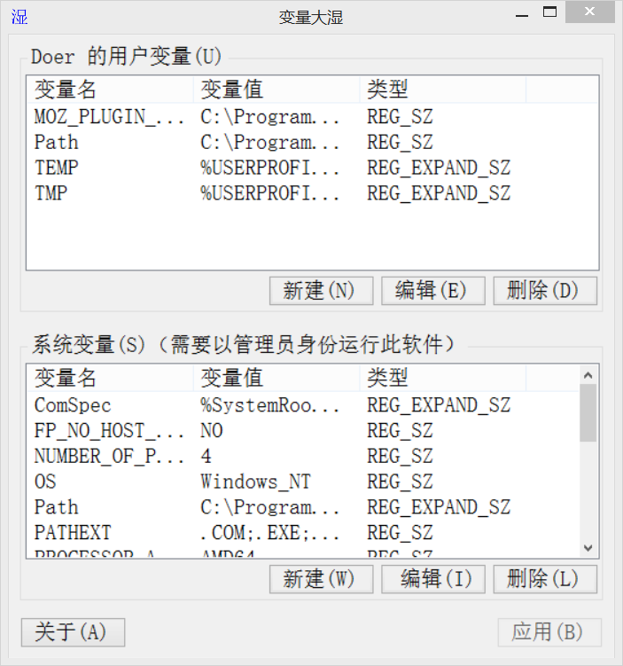
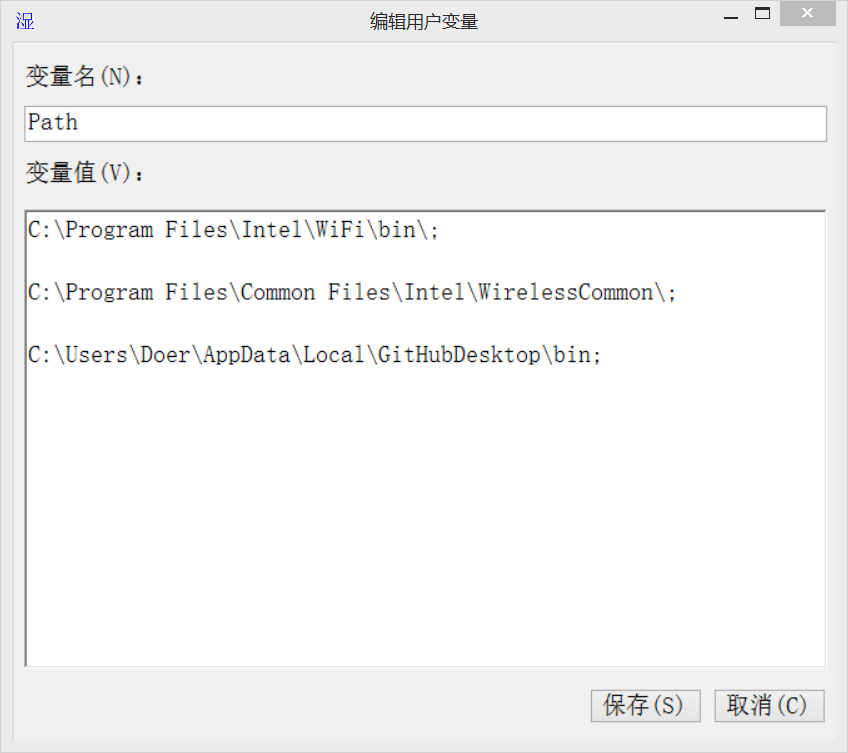

软件说明
========
系统自带的环境变量管理器在编辑环境变量时，变量值和变量名都显示在一行当中，很不方便（特别是编辑path变量时），所以写了这个工具。

使用这款软件添加或编辑变量时，为方便查看变量的内容，软件自动在每个以分号";"相隔的目录后面添加了换行符，保存时，自动删除变量中所有的换行符。

效果截图
========

 

软件下载
============
请到项目文件夹EnvironmentVariablesManager\bin\Release目录下下载exe文件。

历史版本
========
【版本】2.7
更新日期：20190111
更新内容：
- 修改点击主界面的“关于”按钮的事件；
- 统一、规范namespace名称为EnvironmentVariablesMaster

【版本】2.6
更新日期：20190111
更新内容：
- 在删除完一项后，自动定位下一项或上一项，如果该项不是第一项，就往前删，如果是第一项，就往后删除；
- 优化了修改系统环境变量权限不足时的异常提示。

【版本】2.5
更新日期：20190110
更新内容：
- 将变更写入注册表时，判断变量存储类型的依据改变了，提升了性能；
- 修复了item数量为零时，新建item后编辑按钮和删除按钮扔然不可选的bug。

【版本】2.4
更新日期：20190110
更新内容：
- 修复了新建变量时无法正确判断该变量是否已存在的bug。

【版本】2.3
更新日期：20190110
更新内容：
- 修复了点击编辑窗口中的保存按钮后换行符没有正常删除的bug；
- 修复了主界面保存按钮快捷键冲突的问题。

【版本】2.2
更新日期：20190110
更新内容：
- 修复了删除item不生效的bug；
- 处理了子键不存在时读取失败的异常。

【版本】2.1
更新日期：20190110
更新内容：
- 更正界面中各组件的Tabindex顺序，实现了按下alt + u/s/n/v后相应的组件获得焦点；
- 更正编辑界面中保存按钮和取消按钮的大小。

【版本】v2.0
更新日期：20190109
更新内容：
作了如下改进：
- 窗口加载时，对ListView的item按升序进行排序；
- 选中listView中的item后输入回车键打开编辑界面，输入Del键删除item；
-  当所有项都已经删除完成，将编辑按钮和删除按钮设置为不可选中。

【版本】v1.0
更新日期：20190109
更新内容：
实现了基本的系统变量查看和编辑功能。

需要修改的Bug
=================
- 修改环境变量之后，无法及时生效。例如，在软件中删除了Path变量中的某个路径，打开系统自带的环境变量管理窗口可以看到该路径确实删除了，但是该路径还是可以访问。再比如，在软件中向Path变量中添加了某个路径，打开系统自带的环境变量管理窗口可以看到该路径确实添加了，但是该路径还是不能访问！

需要改进的地方
===============
- 应该把软件使用到的所有的库打包在一起，这样就可以避免版本不够的用户使用不了；
- 调整listView列的尺寸；
- 让组件自适应窗口，使窗口大小可以调节；
